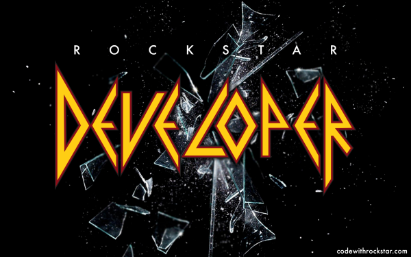

# Rockstar Songs

### Language:

---

[Rockstar](https://github.com/RockstarLang/rockstar) is a dynamically typed computer programming language, designed for creating programs that are also song lyrics. Rockstar is heavily influenced by the lyrical conventions of 1980s hard rock and power ballads.
Created by [Dylan Beattie](https://dylanbeattie.net/).

### [Specification](https://github.com/RockstarLang/rockstar/blob/main/spec.md):

---

[Rockstar](https://codewithrockstar.com/) is intended to give the programmer an unprecedented degree of poetic license when it comes to the composition and structure of their programs.

### Purpose of this repo

---

It has been a while since the last time I had this much fun coding. Rockstar Language was a welcome surprise in my life that reminded me why I love this profession so much. Thank you Dylan! I will be storing here all attempts of crazy 80's songs I can come up with. :smile: :guitar:
